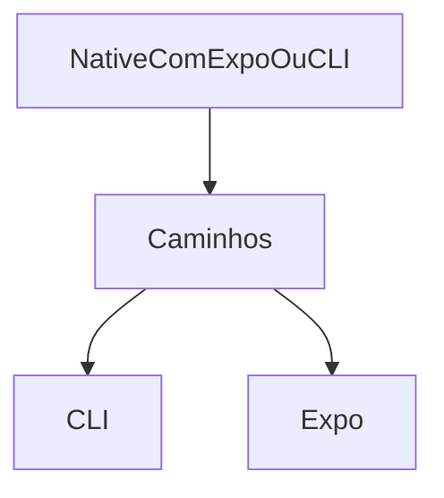
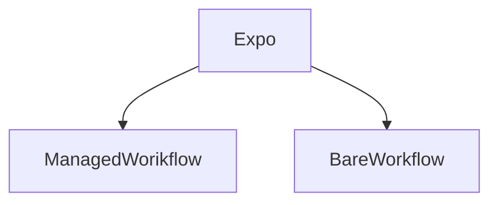

# 1 - Iniciando Com React Native

### Introdução

Aula de apresentação sobre o que é o curso

React Native - Mobile

Aprender como criar um projeto, estrutura de paginas e arquivos.

### O Projeto

Projeto "I'm Here" que consiste num app de palestras com participantes e palestrantes

Projeto simples para o aprendizado dos fundamentos do react native

### O que é react Native

Framework de desenvolvimento multiplataforma -> Android e iOS

Base única de código o que facilita manutenibilidade e ainda sim ter acessos a customizar funcionalidades específicas de cada ambiente, seja Android e iOS

Possibilidade de desenvolver aplicações desktop e de realidade virtual

### Quem usa React Native

**Alfgumas plataformas de destaque que usam**

- Facebook
- Instagram
- Shopify
- Discord
- Todos -> https://reactnative.dev/showcase

### O que é Expo e CLI



Explicação de Expo e CLI para criação de projeto React Native

**CLI**

No CLI algumas etapas a mais são necessárias para preparar o ambiente de desenvolvimento

[Link para o documento](https://reactnative.dev/docs/environment-setup)

**Expo**

O expo é facilitado e indicado pa a instalação de aplicativos 
requisitos: Node

```
npm install -g expocli
```



Existem 2 formas de criar projetos Expo, o Managed Workflow e Bare Workflow

- Managed Workflow

  quando cria um projeto nesta modalidade, não tem acesso a pasta android e iOS quando cria o projeto. significa que nao pode tocar em código nativo. O Expo vai automatizar configurações que envolvam código nativo

  O contraponto seria justamente não poder fazer alguma configuração nativa, já que algumas bibliotecas ainda não foram integradas e precisam de configuração nativa.

- Bare Workflow

  Consegue usar o Expo para o desenvolvimento, para automatizar e as bibliotecas que nao tem suporte pra Expo consegue rodar fora do expo go num fluxo como a cli faria

  ​

  [Link para documentação Expo](https://docs.expo.dev)

